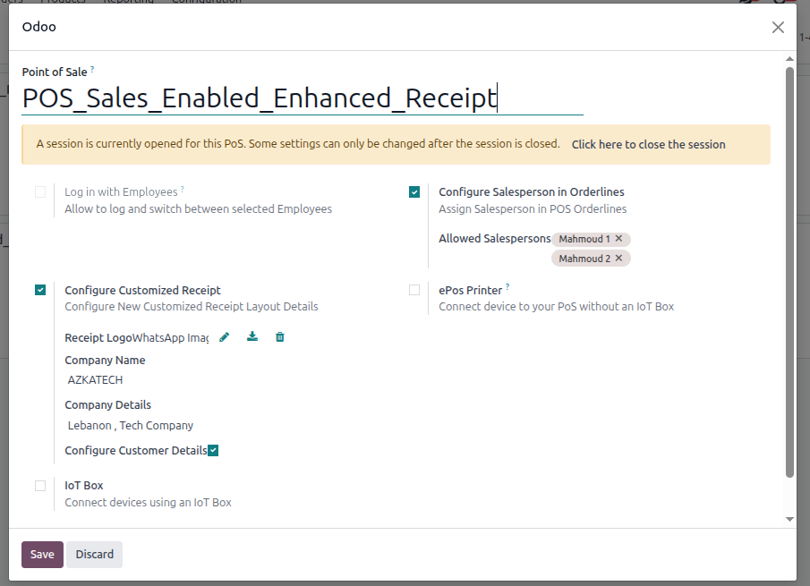

# Odoo Developer Technical Assessment - Azkatech
**Candidate:** Mahmoud Magdy  
**Odoo Version:** 18.0  
**Submission Date:** 2025-10-12  

---

## 🧩 Overview
This repository contains my implementation for **Exercise 3 (POS Enhancements)** from the Azkatech Odoo Developer Technical Assessment.

It includes two fully functional Odoo modules:

1. **azk_pos_salesperson**  
   Adds salesperson assignment per POS order or per line, with backend configuration and POS frontend popup.

2. **azk_pos_custom_receipt**  
   Adds a customizable POS receipt layout per configuration (logo, company details, customer info, and salesperson display).

Both modules are designed to be modular, independent, and compatible with Odoo 17 Enterprise and Community editions.

---

## ⚙️ Installation

1. Copy both modules to your Odoo `addons` directory, or add the folder path to your Odoo command using `--addons-path`.
2. Restart your Odoo server.
3. Update the Apps list:
   - In Developer Mode, go to **Apps → Update Apps List**.
4. Search and install:
   - `Azk POS Salesperson`
   - `Azk POS Custom Receipt`

Or install/upgrade from CLI:
```bash
./odoo-bin -d your_db -u azk_pos_salesperson,azk_pos_custom_receipt --addons-path=/path/to/addons,/path/to/azk_assessment_mahmoud
```

---

## 🔧 Configuration Steps

### 🔹 For Salesperson Assignment:
1. Go to **Point of Sale → Configuration → Point of Sale**.
2. Edit the POS configuration and enable **“Enable Salesperson Assignment”**.
3. Select the allowed salespersons from the new menu **POS Salespersons**.
4. When you open a POS session, a popup will allow selecting a salesperson per order line.

### 🔹 For Custom Receipt:
1. In the same POS configuration, enable **“Use Customized Receipt”**.
2. Upload your logo, company name, and extra details.
3. Enable **“Show Customer Details”** if you want the customer name to appear.
4. When the order is validated, the printed receipt will use your customized design.

---

## 💻 Features Summary

### 🧍‍♂️ azk_pos_salesperson
- Adds new model `pos.sale.person` (fields: Name, Phone, Employee).
- Adds `salesperson_id` field to `pos.order.line`.
- Adds new button in POS UI to select salesperson per product line.
- Integrates with offline POS mode — salesperson data is stored in local cache and synced.
- Fully configurable through POS settings.

### 🧾 azk_pos_custom_receipt
- Adds custom logo, header details, and customer info to POS receipt.
- Allows toggling between default Odoo receipt and customized layout.
- Shows salesperson name under each order line.
- Respects POS config settings dynamically (per configuration).

---

## 🧪 Manual Testing Checklist

| Scenario | Expected Result |
|-----------|----------------|
| Enable Salesperson Assignment | New salesperson selection popup appears in POS |
| Assign Salesperson per line | Saved correctly in backend (pos.order.line) |
| Disable Salesperson Assignment | POS UI hides selection button |
| Enable Custom Receipt | Receipt layout changes with logo & details |
| Disable Custom Receipt | Falls back to default Odoo layout |
| Assign Salesperson + Custom Receipt | Salesperson appears under each product line in receipt |

---

## 🧠 Technical Notes

- **Models extended:**  
  - `pos.order.line` → added `salesperson_id`  
  - `pos.config` → added config fields for both features  
  - `pos.sale.person` → new model for managing salespersons  

- **Frontend (JavaScript / OWL):**
  - New POS popup component for salesperson selection.  
  - `Orderline` and `Order` export/import methods extended to include salesperson info.  

- **QWeb Templates:**
  - Custom receipt inherits and conditionally replaces Odoo’s default POS receipt.  
  - Layout controlled by `use_customized_receipt` flag in `pos.config`.

---

## 📸 Screenshots

### POS Configuration


### POS Popup Selection


### Custom Receipt


### Backend Order


---

## 🧰 Development Environment

| Component | Version / Notes |
|------------|----------------|
| OS | Ubuntu 22.04 |
| Odoo | 18.0 |
| Database | PostgreSQL 14 |
| Browser | Brave |
| IDE | Pycahrm |

Odoo launched using:
```bash
./odoo-bin -d test_db --dev=reload,qweb,assets --addons-path=/path/to/addons,/path/to/azk_assessment_mahmoud
```

---

## 🤖 GenAI Usage

A documentation file (`docs/genai_usage.md`) is included, describing how ChatGPT (GPT-5) was used to:
- Scaffold the module structure.
- Draft technical components (JS, XML, models).
- Review ORM logic and documentation.
- Maintain Odoo best practices.

All outputs were reviewed, debugged, and tested manually.

---

## 📦 Packaging & Notes

Both modules are installable individually or together.  
Each has a valid `__manifest__.py` and properly scoped namespaces (`azk_...`).  
Compatible with Odoo POS offline cache, and follows Odoo coding standards.

---

## 🧾 License
For Azkatech Technical Assessment only.  
All code written by **Mahmoud Magdy (2025)**.

---

## 📬 Contact
**Mahmoud Magdy**  
📧 mahmoudmagdy206@rocketmail.com  
🌐 GitHub: [https://github.com/mahmoudmagdy146/azk_assessment_mahmoud](#)
